# Linux Scheduler Performance Test Harness

This repository contains a complete test harness to compare the performance of different Linux schedulers using a realistic workload.

## Overview

Using `sched_ext` (Extended Scheduling Class), we can dynamically switch between different Linux schedulers and measure their impact on application performance. This project uses Gatling to load test a Spring Boot banking application running in a QEMU VM under different scheduler configurations.

The aim is to test which scheduler has the better performance when running a Spring Boot Application. The application runs in an isolated QEMU/Debian VM while the load testing and orchestration happens on the host machine.

## Project Structure

```
linux-scheduler-test/
├── pom.xml                          # Main Maven project for Gatling tests
├── spring-boot-app/                 # Spring Boot banking application
│   ├── pom.xml
│   └── src/main/java/com/banking/   # Banking app source code
├── src/test/scala/simulations/      # Gatling load test simulations
│   └── BankingTransactionSimulation.scala
├── scripts/
│   ├── setup-vm.sh                  # One-time VM provisioning
│   ├── vm-start.sh                  # Start the QEMU VM
│   ├── vm-stop.sh                   # Stop the QEMU VM
│   ├── vm-ssh.sh                    # SSH into the VM
│   ├── vm-snapshot.sh               # Create/restore VM snapshots
│   ├── vm-scheduler-switch.sh       # Switch schedulers in VM
│   ├── run-scheduler-test.sh        # Main test orchestrator
│   ├── start-app.sh                 # Start app locally (legacy)
│   ├── simple-test.sh               # Run test without scheduler switching
│   └── analyze-results.sh           # Analyze test results
├── vm/                              # VM images and config (generated)
└── results/                         # Test results (generated)
```

## Scope

- **Spring Boot Application**: Simulates a Banking Transaction system with REST APIs (runs in VM)
- **Message Broker**: Uses Kafka for async message processing (runs in VM, pre-installed)
- **Database**: H2 in-memory database for fast transaction processing
- **Load Testing**: Gatling framework with realistic user scenarios (runs on host)
- **VM Infrastructure**: QEMU with Debian 13 (trixie), cloud-init provisioning, 16GB RAM, kernel 6.12+ with sched_ext support, Kafka and Zookeeper pre-installed
- **Schedulers Tested**:
  - CFS (Completely Fair Scheduler) - default Linux scheduler
  - scx_rusty - Rusty sched_ext scheduler  
  - scx_lavd - Low-latency scheduler
  - scx_bpfland - BPF-based scheduler
  - scx_layered - Layered scheduler

## Testing

### Unit and Integration Tests

The Spring Boot application includes a comprehensive test suite with 30 JUnit 5 tests:

```bash
cd spring-boot-app
mvn test
```

Test execution completes in **7-10 seconds** and includes:
- **BankingApplicationTest**: 2 context loading tests
- **BankingServiceTest**: 10 banking operation tests (deposits, withdrawals, transfers)
- **BankingControllerTest**: 12 REST endpoint tests
- **ComputationalServiceTest**: 6 computational workload tests

**Test Configuration**:
- Uses H2 in-memory database
- Kafka disabled for tests via `@ConditionalOnProperty(name="kafka.enabled")`
- Fraud detection threshold set to 50000 for tests (vs 150 in production)
- All tests run in isolation with `@Transactional` rollback

## Prerequisites

### Host System Requirements
- Linux with KVM support (any modern distribution)
- QEMU/KVM installed
- Java 17 or higher (for Gatling on host)
- Maven 3.6+
- 16GB+ RAM recommended (VM uses 16GB)
- 50GB+ free disk space (for VM image and kernel builds)

### Installing Host Dependencies
```bash
# On Debian/Ubuntu
sudo apt-get update
sudo apt-get install qemu-system-x86_64 qemu-utils cloud-image-utils \
  openssh-client netcat-openbsd openjdk-17-jdk maven

# Enable KVM (if not already enabled)
sudo modprobe kvm
sudo modprobe kvm_intel  # or kvm_amd for AMD CPUs
sudo usermod -aG kvm $USER  # Add yourself to kvm group
# Log out and back in for group change to take effect
```

## Quick Start

### 1. One-Time VM Setup (Takes 45-60 minutes)
```bash
# This creates and provisions a Debian VM with Kafka and sched_ext support
./scripts/setup-vm.sh
```

This will:
- Download Debian cloud image
- Create a QEMU VM with 16GB RAM, 40GB disk
- Install Java, Maven, Rust, build tools, Kafka, and Zookeeper
- Configure Kafka topics (transactions, fraud-alerts)
- Clone and build sched_ext kernel schedulers
- Create a clean snapshot for easy resets

**Note**: Kafka and Zookeeper are automatically installed and configured in the VM. No separate setup needed!

### 2. Build the Spring Boot Application
```bash
cd spring-boot-app
mvn clean package
cd ..
```

### 3. Start the VM
```bash
./scripts/vm-start.sh
```

The VM will be accessible at:
- SSH: `localhost:2222`
- Application: `localhost:8080` (once deployed)
- Kafka: `localhost:9092`

Kafka and Zookeeper start automatically with the VM.

### 4. Run Full Scheduler Comparison
```bash
./scripts/run-scheduler-test.sh
```

This will:
- Deploy the Spring Boot app to the VM (with Kafka enabled)
- Test CFS and all available sched_ext schedulers
- Run 5-minute load tests for each scheduler
- Generate comprehensive reports with Gatling
- Collect system metrics from the VM

### 5. View Results
```bash
# Results are saved with timestamp
ls -la results/

# Open Gatling HTML report in browser
firefox results/[timestamp]/cfs_gatling_results/index.html
```

### 6. Stop the VM When Done
```bash
./scripts/vm-stop.sh
```

## Load Test Scenarios

The Gatling simulation includes 4 concurrent scenarios:

1. **Create Account** (10 users/sec): Creates new banking accounts
2. **Transfer Money** (50 users/sec): Performs money transfers between accounts
3. **Check Balance** (100 users/sec): Reads account balances
4. **Transaction History** (20 users/sec): Retrieves transaction history

Each scenario ramps up gradually, maintains steady load, then ramps down.

## VM Management

### SSH into VM
```bash
./scripts/vm-ssh.sh
# Or with a command
./scripts/vm-ssh.sh "ls -la /opt/banking-app"
```

### Create Snapshot (Save VM State)
```bash
./scripts/vm-snapshot.sh create my-snapshot-name
```

### Restore from Snapshot
```bash
# Stop VM first
./scripts/vm-stop.sh

# Restore snapshot
./scripts/vm-snapshot.sh restore my-snapshot-name

# Start VM again
./scripts/vm-start.sh
```

### List Snapshots
```bash
./scripts/vm-snapshot.sh list
```

### Restore Clean State Before Tests
```bash
# Automatically restore snapshot before running tests
RESTORE_SNAPSHOT=clean-install ./scripts/run-scheduler-test.sh
```

## Analyzing Results

### View Gatling HTML Reports
```bash
./scripts/analyze-results.sh results/[timestamp]
```

Then open the HTML reports in a browser:
```bash
firefox results/[timestamp]/cfs_gatling_results/index.html
```

### Key Metrics to Compare
- **Response Time**: p50, p75, p95, p99 percentiles
- **Throughput**: Requests per second
- **Error Rate**: Failed requests percentage
- **System Load**: CPU load average during test (from VM)
- **Scheduler State**: Verify correct scheduler was active

## API Endpoints

The Spring Boot application exposes:

- `POST /api/accounts` - Create account
- `GET /api/accounts/{id}` - Get account details
- `GET /api/accounts/{id}/balance` - Get account balance
- `POST /api/transactions/transfer` - Transfer money
- `GET /api/accounts/{id}/transactions` - Get transaction history
- `GET /actuator/health` - Health check

## Customization

### Adjust VM Resources
Edit the VM startup parameters in [scripts/vm-start.sh](scripts/vm-start.sh):
```bash
VM_RAM=16G        # Increase RAM
VM_CPUS=6         # More CPUs
```

### Adjust Load Test Intensity
Edit [src/test/scala/simulations/BankingTransactionSimulation.scala](src/test/scala/simulations/BankingTransactionSimulation.scala):
```scala
constantUsersPerSec(50).during(2.minutes)  // Adjust users and duration
```

### Test Different Schedulers
Edit [scripts/run-scheduler-test.sh](scripts/run-scheduler-test.sh):
```bash
SCHEDULERS=("scx_rusty" "scx_lavd" "scx_bpfland" "scx_layered" "scx_cosmos")
```

### Change Test Duration
```bash
TEST_DURATION=600  # 10 minutes per scheduler in run-scheduler-test.sh
```

## Networking Details

### Port Forwarding (QEMU User-Mode Networking)
- **Host → VM**: 
  - `localhost:2222` → `VM:22` (SSH)
  - `localhost:8080` → `VM:8080` (Spring Boot app)
- **VM → Host**: 
  - `10.0.2.2:9092` → Host Kafka
  - `10.0.2.2` is the special address for the host in QEMU user-mode networking

## Troubleshooting

### VM Won't Start
```bash
# Check if KVM is available
lsmod | grep kvm

# Check QEMU installation
which qemu-system-x86_64

# Check if another VM is running
cat vm/qemu.pid
ps aux | grep qemu
```

### SSH Connection Refused
```bash
# Check if VM is running
nc -z localhost 2222

# Check VM logs (if VM started in foreground)
# Or restart VM with verbose output
VM_RAM=12G VM_CPUS=4 ./scripts/vm-start.sh
```

### Schedulers Not Found in VM
```bash
# SSH into VM and check installation
./scripts/vm-ssh.sh
ls -la /usr/local/bin/scx_*
which scx_rusty

# Rebuild schedulers if needed
cd ~/scx
source ~/.cargo/env
make
sudo make install
```

### Application Won't Start in VM
```bash
# Check if Java is installed
./scripts/vm-ssh.sh "java -version"

# Check application logs
./scripts/vm-ssh.sh "cat /opt/banking-app/app.log"

# Check if port 8080 is already in use
./scripts/vm-ssh.sh "netstat -tlnp | grep 8080"
```

### Kafka Connection Issues
```bash
# Verify Kafka is running on host
docker ps | grep kafka
netstat -tlnp | grep 9092

# Test connectivity from VM to host
./scripts/vm-ssh.sh "nc -zv 10.0.2.2 9092"

# Application will work without Kafka (degrades gracefully)
```

### Slow VM Performance
```bash
# Ensure KVM acceleration is enabled
./scripts/vm-ssh.sh "cat /proc/cpuinfo | grep -E 'vmx|svm'"

# Increase VM resources
VM_RAM=16G VM_CPUS=6 ./scripts/vm-start.sh
```

## Resources

- [sched_ext GitHub](https://github.com/sched-ext/scx/tree/main)
- [sched_ext Documentation](https://github.com/sched-ext/scx/blob/main/README.md)
- [Gatling Documentation](https://gatling.io/docs/gatling/)
- [Spring Boot Documentation](https://spring.io/projects/spring-boot)
- [QEMU Documentation](https://www.qemu.org/documentation/)
- [cloud-init Documentation](https://cloudinit.readthedocs.io/)

## Architecture

```mermaid
graph TB
    subgraph Host["🖥️ Host Machine"]
        Gatling["📊 Gatling Load Tester<br/>(Maven/Scala)"]
        Kafka["📨 Kafka Broker<br/>(Docker)<br/>Port 9092"]
        
        subgraph PortForward["Port Forwarding"]
            PF1["localhost:2222 → VM:22"]
            PF2["localhost:8080 → VM:8080"]
        end
    end
    
    subgraph VM["💻 Debian 13 VM<br/>(16GB RAM, 8 vCPUs, Kernel 6.12.6)"]
        subgraph App["Spring Boot Banking App"]
            REST["🌐 REST API<br/>Port 8080"]
            H2["💾 H2 Database<br/>(In-Memory)"]
            KProducer["📤 Kafka Producer"]
        end
        
        subgraph Schedulers["⚙️ sched_ext Schedulers"]
            SCX1["scx_rusty"]
            SCX2["scx_lavd"]
            SCX3["scx_bpfland"]
            SCX4["scx_layered"]
        end
        
        SchedState["📋 /sys/kernel/sched_ext/state<br/>(Active Scheduler)"]
    end
    
    Gatling -->|HTTP Requests| PF2
    PF2 -->|8080| REST
    
    Kafka -->|10.0.2.2:9092| KProducer
    KProducer -.->|Events| Kafka
    
    REST --- H2
    
    Schedulers -.->|Controls| App
    SchedState -.->|Status| Schedulers
    
    style Host fill:#e1f5ff
    style VM fill:#fff4e1
    style App fill:#e8f5e9
    style Schedulers fill:#fce4ec
    style PortForward fill:#f3e5f5
```



**Key Components:**
- **Host**: Runs Gatling load tests and optional Kafka broker
- **VM**: Isolated Debian environment with custom kernel for scheduler testing
- **Networking**: QEMU user-mode networking (`10.0.2.2` = host from VM perspective)
- **Schedulers**: Dynamically switchable via `/sys/kernel/sched_ext/state`

## Limitations

### Virtualization Overhead
- **Not Bare Metal**: Tests run in QEMU/KVM, which adds virtualization overhead that may not reflect bare metal performance
- **Nested Scheduling**: The host's scheduler affects the VM's scheduler, creating a nested scheduling scenario
- **CPU Pinning**: QEMU vCPUs are scheduled by the host kernel, which can introduce variability
- **Impact**: Results show *relative* performance differences between schedulers, not absolute bare metal performance

### Workload Constraints
- **Single Application**: Only tests one Spring Boot application, not representative of multi-application server workloads
- **Synthetic Load**: Gatling simulates user behavior but doesn't capture all real-world patterns
- **In-Memory Database**: H2 database doesn't test I/O-bound workloads that might benefit differently from schedulers
- **No CPU-Intensive Tasks**: Banking operations are relatively lightweight compared to rendering, compilation, or scientific computing

### Scheduler Feature Coverage
- **Limited Topology Testing**: Doesn't extensively test NUMA awareness, cache affinity, or complex CPU topologies
- **No Interactive Workloads**: Doesn't measure desktop responsiveness or latency-sensitive GUI applications
- **Limited I/O Testing**: Minimal testing of I/O scheduler interactions
- **No Real-Time Testing**: Doesn't test real-time scheduling guarantees or deadlines

### Testing Environment
- **Network Latency**: Port forwarding adds minimal latency that wouldn't exist in bare metal deployments
- **Resource Isolation**: VM provides perfect isolation but doesn't test scheduler behavior under system-wide contention
- **Fixed Kernel Version**: Tests specific kernel version (6.12.6), scheduler behavior may vary across versions
- **Limited Schedulers**: Only tests available sched_ext schedulers, not all possible scheduling policies

### Measurement Accuracy
- **Sampling Overhead**: Gatling and metrics collection add measurement overhead
- **Warm-up Effects**: JVM warm-up and JIT compilation affect early test results
- **Statistical Variance**: Results can vary between runs due to system state, cache effects, and timing
- **No Hardware Counters**: Doesn't collect PMU (Performance Monitoring Unit) data for deep CPU analysis

### Recommendations for Interpretation
1. **Use for Comparison**: Results are most valuable for *comparing* schedulers under identical conditions
2. **Understand Context**: Performance differences are specific to this workload and may not generalize
3. **Validate on Bare Metal**: Important findings should be validated on bare metal systems
4. **Consider Your Workload**: Choose schedulers based on similarity to your actual production workload
5. **Multiple Runs**: Run tests multiple times and analyze variance before drawing conclusions

### What This Harness IS Good For
✅ Comparing relative scheduler performance under controlled conditions  
✅ Quick prototyping and testing of scheduler configurations  
✅ Educational exploration of sched_ext capabilities  
✅ Identifying obvious performance regressions or improvements  
✅ Testing scheduler behavior under specific workload patterns

### What This Harness IS NOT Good For
❌ Absolute bare metal performance measurement  
❌ Production deployment decisions without validation  
❌ Testing real-time or latency-critical applications  
❌ Comprehensive scheduler feature validation  
❌ Hardware-specific optimizations (NUMA, cache topology)

## License

MIT

